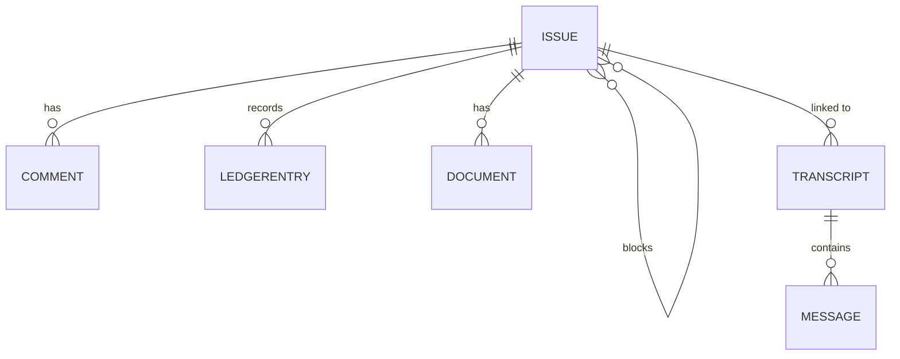

<!-- CONTRACT: Core entities — fields, types, invariants, relationships —
     shaped to translate directly into Pydantic V2 models or Go structs.
     Storage technology lives in stack.md; module boundaries in
     architecture.md (each entity is assigned to one of its modules). -->

# Sutra — Data models

All entities live in the `domain` module (architecture.md); `store` persists
them. Timestamps are UTC. IDs are short stable identifiers (kata-style).

## Entities

### Issue
- **Module:** `domain`
- **Fields:**

| Field | Type | Required | Notes |
|-------|------|----------|-------|
| `id` | string | yes | short stable id, generated |
| `subject` | string | yes | the one required content field |
| `body` | string | yes | the one required content field |
| `type` | enum | no | `feature` \| `bug` \| `task` \| `chore`; default `task` |
| `status` | enum | no | `open` \| `in_progress` \| `closed`; default `open` |
| `priority` | enum | no | `p0` \| `p1` \| `p2` \| `p3`; default `p2` |
| `owner` | string | no | the **agent** assigned to the issue (agent-assisted dev), not a human user |
| `parent_id` | string → Issue | no | parent in the parent/child tree |
| `labels` | []string | no | read-derived view over the `issue_label` join; free-text tags |
| `deleted_at` | timestamp | no | null = live; set = soft-deleted |
| `created_at` | timestamp | yes | set on create |
| `updated_at` | timestamp | yes | set on every change |

- **Invariants:**
  - `subject` and `body` are non-empty.
  - `parent_id`, if set, references an existing Issue and must not create a
    cycle in the parent/child tree.
  - An Issue cannot be its own parent.
  - A soft-deleted Issue (`deleted_at` set) is excluded from default lists
    and search.

### Comment
- **Module:** `domain`
- **Fields:**

| Field | Type | Required | Notes |
|-------|------|----------|-------|
| `id` | string | yes | generated |
| `issue_id` | string → Issue | yes | owning issue |
| `author` | string | no | agent or human that wrote the comment |
| `body` | string | yes | comment text |
| `created_at` | timestamp | yes | |

- **Invariants:**
  - `issue_id` references an existing Issue.
  - `body` is non-empty.

### LedgerEntry
- **Module:** `domain`
- One row per change to an Issue — the audit trail.
- **Fields:**

| Field | Type | Required | Notes |
|-------|------|----------|-------|
| `id` | string | yes | generated |
| `issue_id` | string → Issue | yes | the issue that changed |
| `at` | timestamp | yes | when the change happened |
| `actor` | string | no | agent or human that made the change |
| `kind` | enum | yes | `created` \| `updated` \| `commented` \| `status_changed` \| `linked` \| `deleted` |
| `field` | string | no | field that changed (for `updated`/`status_changed`) |
| `old_value` | string | no | prior value |
| `new_value` | string | no | new value |

- **Invariants:**
  - `issue_id` references an existing Issue.
  - Ledger entries are append-only — never updated or deleted.

### Document
- **Module:** `domain`
- A doc-driven-development document attached to any issue.
- **Fields:**

| Field | Type | Required | Notes |
|-------|------|----------|-------|
| `id` | string | yes | generated |
| `issue_id` | string → Issue | yes | owning issue (any type) |
| `kind` | enum | yes | `problem` \| `design` \| `plan` \| `scenarios` |
| `title` | string | no | display title |
| `content` | string | yes | markdown; indexed for search |
| `created_at` | timestamp | yes | |
| `updated_at` | timestamp | yes | |

- **Invariants:**
  - `issue_id` references an existing Issue (no issue-type restriction).
  - `content` is non-empty.

### Transcript
- **Module:** `domain`
- A captured Claude session — the container for its Messages. Ingested from
  `~/.claude/projects/<encoded-cwd>/<session-uuid>.jsonl`.
- **Fields:**

| Field | Type | Required | Notes |
|-------|------|----------|-------|
| `id` | string | yes | generated |
| `session_id` | string | yes | the JSONL filename UUID; **unique** — ingestion key |
| `source_path` | string | yes | absolute path of the source JSONL |
| `title` | string | no | derived from first user message |
| `issue_id` | string → Issue | no | linked issue (nullable; linked after ingest) |
| `captured_at` | timestamp | yes | when the session started: first event timestamp / file mtime |
| `created_at` | timestamp | yes | when ingested |
| `source_mtime` | timestamp | no | source file mtime at ingest (last-modified time); used to skip re-ingesting unchanged sessions and to place the session in the activity feed's window |

- **Invariants:**
  - `session_id` is unique — re-ingesting the same session updates in place
    (idempotent), never duplicates.
  - `issue_id`, if set, references an existing Issue.

### Message
- **Module:** `domain`
- One row per JSONL line within a Transcript.
- **Fields:**

| Field | Type | Required | Notes |
|-------|------|----------|-------|
| `id` | string | yes | generated |
| `transcript_id` | string → Transcript | yes | owning transcript |
| `seq` | int | yes | line order within the transcript |
| `role` | enum | yes | `user` \| `assistant` \| `tool` \| `system` |
| `text` | string | no | extracted plain text; indexed for search |
| `raw` | string | yes | original JSON line — lossless render source |
| `at` | timestamp | no | event timestamp if present |

- **Invariants:**
  - `transcript_id` references an existing Transcript.
  - `(transcript_id, seq)` is unique — stable ordering.

## Associations (join tables)

These represent Issue relationships; they hold no domain fields of their own.

| Table | Columns | Meaning |
|-------|---------|---------|
| `issue_label` | `issue_id`, `label` | an Issue's free-text labels |
| `issue_relation` | `issue_id`, `related_issue_id` | "related" links, separate from parent/child |
| `issue_block` | `blocker_id`, `blocked_id` | directional block; `blocked_by` and `is_blocking` are **derived** (incoming vs outgoing edges) |

## Search index

Not a domain entity — a `store`-level full-text index (see stack.md for the
engine) derived from the above. Indexed text: `Issue.subject` +
`Issue.body`, `Document.content`, and `Message.text`. A Message hit rolls up
to its Transcript (and its Issue, if linked). Soft-deleted Issues are
excluded.

## Relationships

